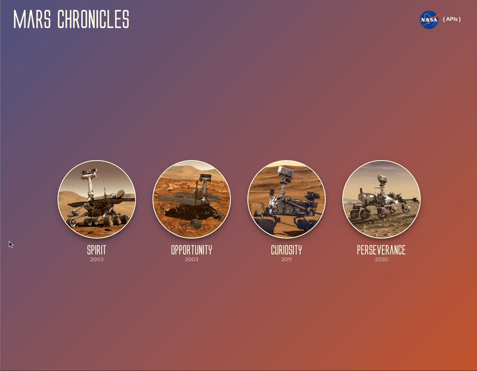

# [Mars Chronicles](https://mars-chronicles.vercel.app/)

## Abstract:

  For millenia mankind has looked up at the planetary bodies that encircle us and sought to understand their nature, whether that be through folklore or scientific observation. The Mars Chronicles app enables users to foster this sense of wonder as they explore photographic data from the surface of Mars itself - returned directly from NASA's past and current Mars Rover missions.

  A user can choose between the four Mars rovers that have existed thus far, including rovers that have completed their tour of service and have since been retired (to rural Mars). Users can then choose either a Mars sol (a Mars day/night cycle during the missions duration) or the date on Earth they want results from. Once criteria has been selected, a user will be shown the photos taken by the mars rover on that day, which they can interact with in order to see in a larger, singular view in full resolution.

  This app is ideal to share with friends and family, and is appropriate for all audiences to help ensure that we have a new generation of people looking up at the sky and wondering where we can take our instruments next.

## Contributors:
[//]: <>

[Kass Daniello](https://github.com/Zertroz) \
[Jason Kirchman](https://github.com/kirch1) \
[Bea Ordonez](https://github.com/bea-ordonez) \
[Shane Misra](https://github.com/sdmisra) 

[//]: <>

## Installation Instructions:
[//]: <>

1. Clone down this repo

1. Install dependencies by using ‘npm install’ in your terminal within the root directory.

1. To host website on your local machine, run ’npm start’ in terminal.

1. A window should be opened in your default browser, if not, navigate to http://localhost:3000 in your preferred browser to view the hosted application!

Alternatively, the app is deployed via Vercel and a link is below.

## Testing Instructions:
[//]: <>

To run the test suite associated with the functions behind the scenes and how they interact: 

Run 'npm run cypress' from the terminal while within the main directory of the application and select E2E Testing, and your chosen browser in the following window.

## Preview of App:
[//]: <>

## Live demo:

Application is deployed live at: [Vercel](https://mars-chronicles.vercel.app/)

## Context:
[//]: <>

This project was assigned in the third week of module 3 for Front End students at Turing. The work was completed over the course of the following two weeks. 

## Learning Goals:
[//]: <>

- Further practice React skillset
- Familiarize ourselves with Redux
- Create a multi-page UX using Router
- Implement a controlled form
- Practice async GitHub workflow
- Provide full E2E testing coverage via Cypress
- Deploy final result

## Future Feature Ideas:
[//]: <>

- User login feature, enabling saving photo selection between visits
- 'Suggested Sol' component to offer optional browsing starting points
- Mission Log component -  NASA report retrieval based off of chosen date
